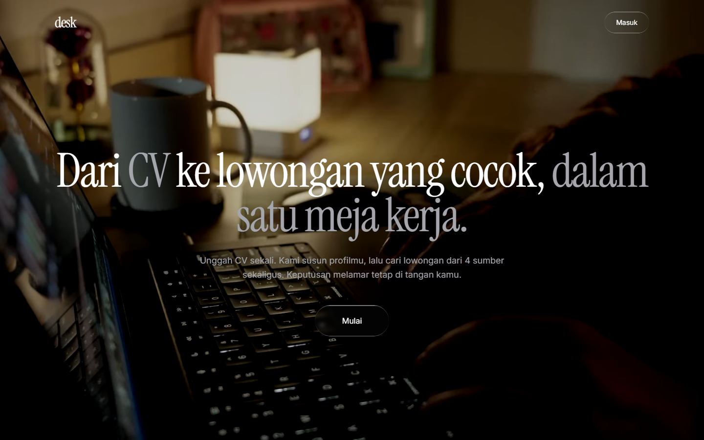
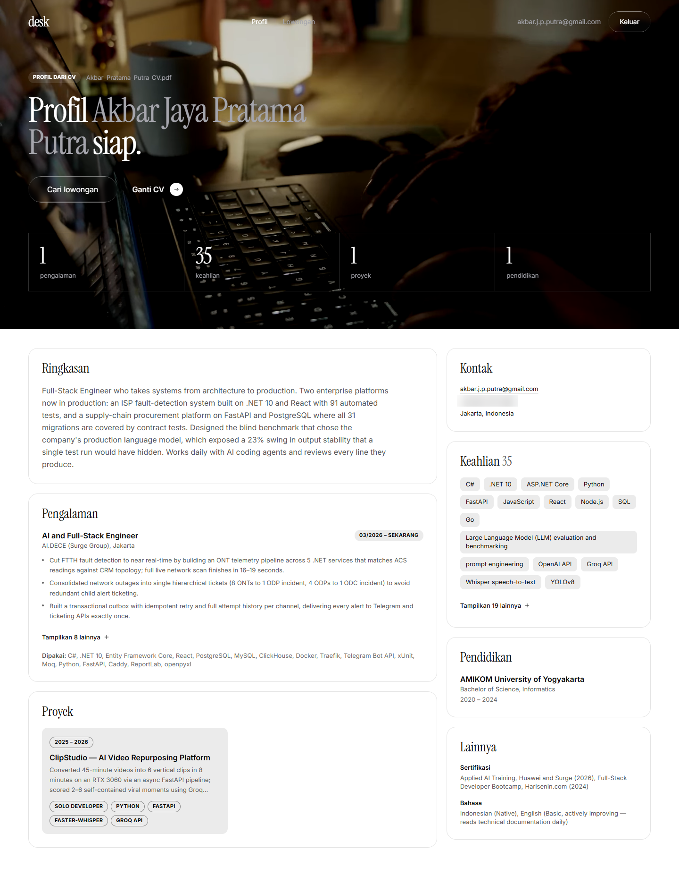
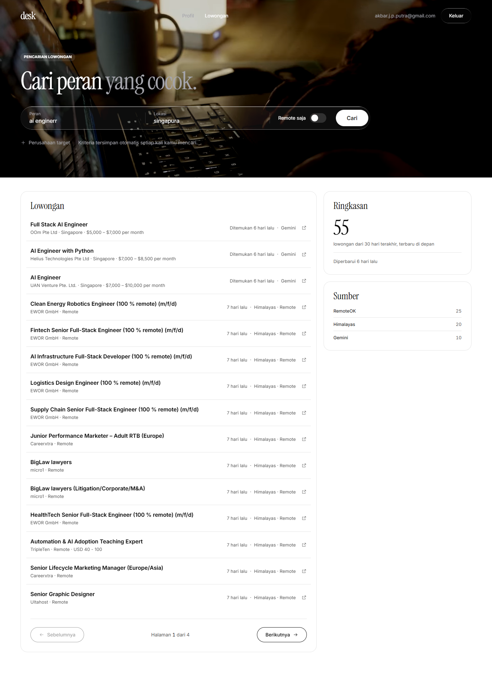
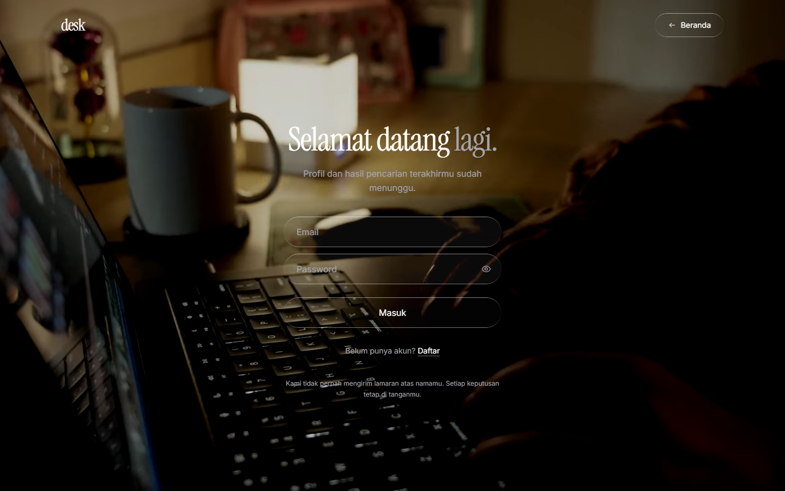

# Job Application Copilot

Web app buat bantu cari kerja: upload CV, profil otomatis tersusun, lalu cari
lowongan dari 4 sumber sekaligus. Keputusan melamar tetap di tangan user
(human-in-the-loop).

> Status: work in progress.



## Fitur

- **Profile Extractor** — CV (PDF/DOCX/TXT) diekstrak jadi profil terstruktur
  pakai Gemini structured output lewat pipeline LangGraph.
- **Auth + simpan profil** — login email/password (Supabase Auth), profil
  tersimpan per user dengan RLS.
- **Job search** — RemoteOK, Himalayas, Adzuna, dan Gemini grounded search
  dijalankan paralel, lalu di-merge dan di-dedupe.

## Screenshot

| Profil | Lowongan |
|---|---|
|  |  |



## Stack

Next.js 16 (App Router, TypeScript, Tailwind v4) · FastAPI · LangGraph ·
Gemini API · Supabase (Auth + Postgres)

## Menjalankan

```bash
# backend
cd backend
python -m venv venv && source venv/bin/activate
pip install -r requirements.txt
cp .env.example .env          # isi GEMINI_API_KEY, Supabase, Adzuna
uvicorn app.main:app --reload --port 8000

# frontend
cd frontend
cp .env.local.example .env.local   # isi NEXT_PUBLIC_SUPABASE_URL/ANON_KEY
npm install && npm run dev
```

Supabase: jalankan `backend/supabase/*.sql` di SQL Editor, dan matikan
"Confirm email" kalau ingin signup langsung login.

## Roadmap

Validasi lowongan · matching + skor kecocokan · CV tailored & cover letter ·
tracker lamaran.
